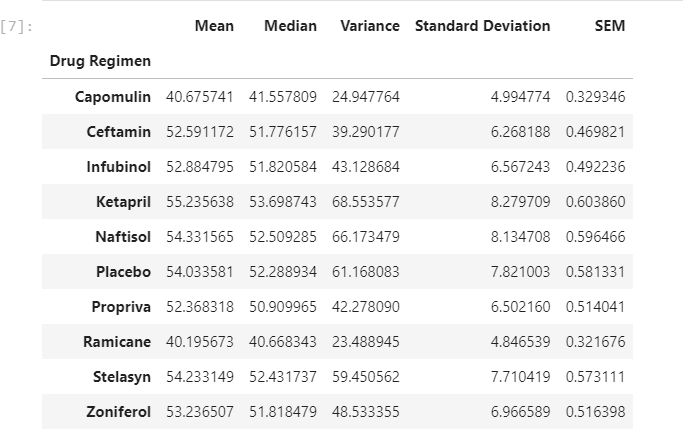
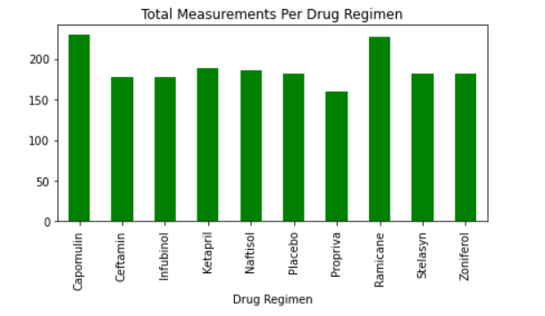
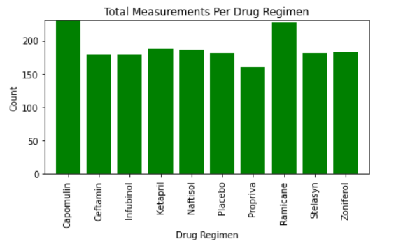
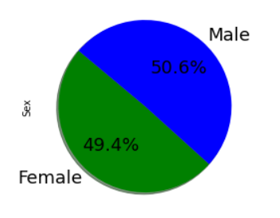
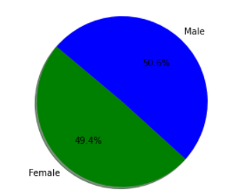
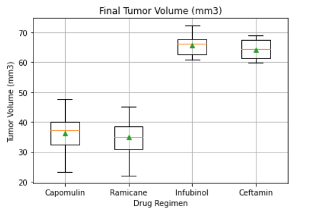
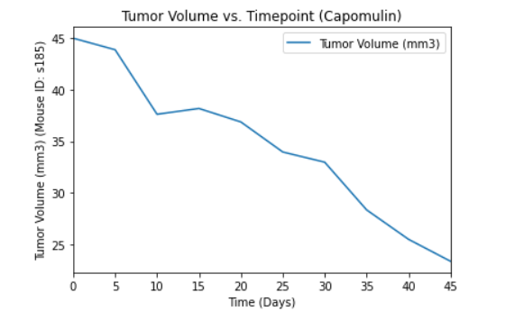
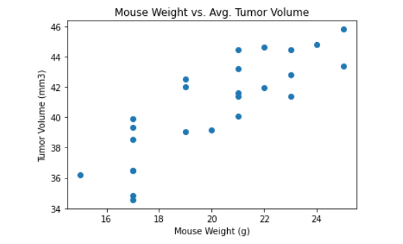
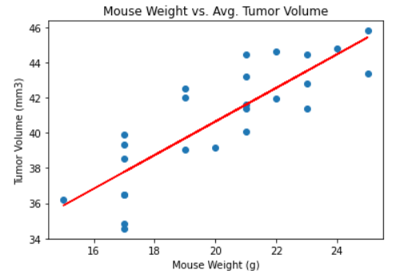

# Pymaceuticals

In this challenge I used mock pharmaceutical trial data (mouse_metadata.csv & study_results.csv, "Resources") to analyze potential treatment regimens for squamous cell carcinoma (SCC). In particular, this challenge compares the performace of Pymaceuticals' drug of interest, Capomulin, to other treatment regimens.

# Tools Used

- Python
- Pandas
- Matplotlib
- Jupyter Notebook
- Linear Regression

# Instructions

Before beginning the analysis, check the data for any mouse ID with duplicate time points and remove any data associated with that mouse ID.

Use the cleaned data for the remaining steps.

Generate a summary statistics table consisting of the mean, median, variance, standard deviation, and SEM of the tumor volume for each drug regimen.

Generate a bar plot using both Pandas's DataFrame.plot() and Matplotlib's pyplot that shows the total number of measurements taken for each treatment regimen throughout the course of the study.
NOTE: These plots should look identical.

 

Generate a pie plot using both Pandas's DataFrame.plot() and Matplotlib's pyplot that shows the distribution of female or male mice in the study.
NOTE: These plots should look identical.

 

Calculate the final tumor volume of each mouse across four of the most promising treatment regimens: Capomulin, Ramicane, Infubinol, and Ceftamin. Calculate the quartiles and IQR and quantitatively determine if there are any potential outliers across all four treatment regimens.

Using Matplotlib, generate a box and whisker plot of the final tumor volume for all four treatment regimens and highlight any potential outliers in the plot by changing their color and style.
Hint: All four box plots should be within the same figure. Use this Matplotlib documentation page for help with changing the style of the outliers.

Select a mouse that was treated with Capomulin and generate a line plot of tumor volume vs. time point for that mouse.

Generate a scatter plot of mouse weight versus average tumor volume for the Capomulin treatment regimen.

Calculate the correlation coefficient and linear regression model between mouse weight and average tumor volume for the Capomulin treatment. Plot the linear regression model on top of the previous scatter plot.

Look across all previously generated figures and tables and write at least three observations or inferences that can be made from the data. Include these observations at the top of notebook.
